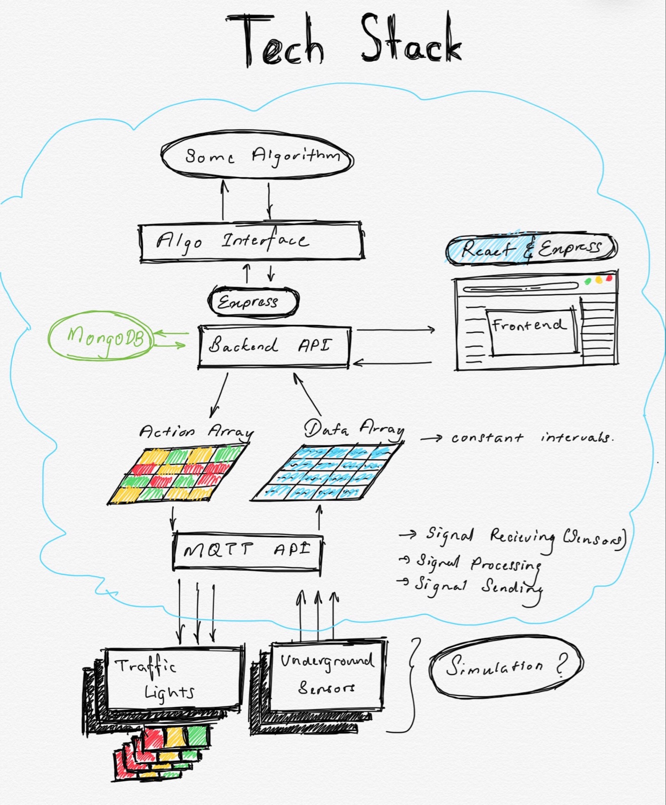

# ReinFlow - Data Node
Node to control all sensor data. 

## Main node for all clients(sensor) connection.
All clients(sensors) will be able to connect to the server on port 5000 locally.  
A Socket.io server where will act as the data control layer and will give potential to give push notifications to any part of the Tech Stack

## events
"<strong>welcome</strong>" - _emitted when a new client(sensor) connects to the node. Sending an acknowleding notification._

## Tech stack

